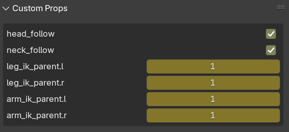
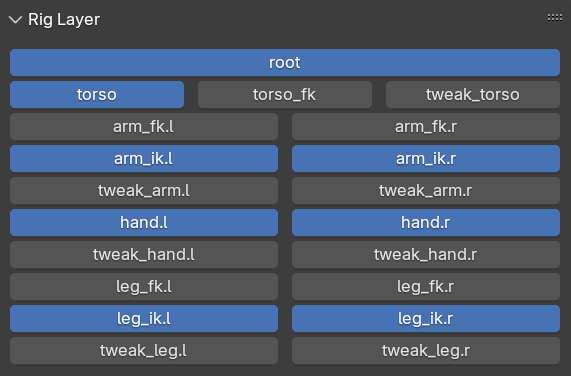
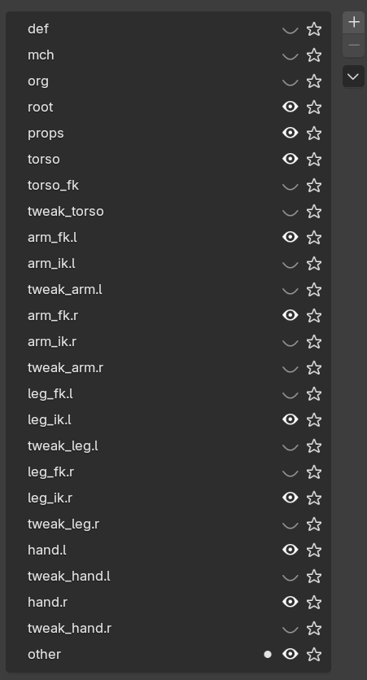

## Introduction

Auto Rig Utils

## Bone Name

Bone names need to be consistent

### torso

### leg

### arm

### finger

## UI

### Auto Rig

row 1-4 -> custom bone color

roll 1, roll 2, heel, foot tip -> foot ctrl

mesh -> edit mode, set foot ctrl location

### Custom Props

### Rig Layer

### Snap Utils

Auto change bone collection visibility in rig layers.

### Auto Assign Collection

